# EduVista

**EduVista** is an AI-powered educational discovery platform that helps students explore colleges, compare institutions, save favorites, and make informed academic decisions — all from a single, modern web application.

🔗 **Live Repository:** [github.com/Ashutosh2275/EduVista](https://github.com/Ashutosh2275/EduVista)

---

## Project Overview

Choosing the right college is one of the most important decisions a student makes, yet information is often scattered across websites, brochures, and forums. **EduVista** solves this by centralizing college and course data into one intuitive platform.

Students can search and filter institutions, view detailed profiles, compare up to three colleges side-by-side, maintain a personal wishlist, and submit enquiries — while administrators manage the entire catalog through a dedicated dashboard backed by live MongoDB data.

---

## Features

### User Features

- **Authentication** — Secure registration, login, logout, and password reset with JWT-based sessions
- **Search & Filtering** — Global search with suggestions, plus filters for type, location, fees, and ratings
- **College Listing** — Responsive grid and list views with sorting and pagination
- **College Details** — In-depth profiles with rankings, fees, placements, courses, and highlights
- **Compare Colleges** — Side-by-side comparison of rankings, fees, placements, and more
- **Wishlist** — Bookmark colleges and compare saved institutions in one click
- **Contact / Enquiry** — Submit enquiries with validated contact details
- **User Dashboard** — Personalized overview with AI recommendations, activity stats, and quick actions

### Admin Features

- **Admin Login** — Role-protected access for platform administrators
- **Dashboard** — Live metrics for users, colleges, courses, enquiries, and registrations
- **College Management** — Full CRUD with publish, archive, and bulk operations
- **Course Management** — Create, update, publish, and archive course listings
- **Enquiry Management** — Review, respond to, and track student enquiries
- **User Management** — Manage student and admin accounts with status controls
- **Analytics** — Registration trends, category distribution, and exportable reports

---

## Tech Stack

### Frontend
- React.js
- React Router
- Tailwind CSS
- Axios

### Backend
- Node.js
- Express.js
- TypeScript

### Database
- MongoDB Atlas

### Authentication
- JWT
- bcrypt

### Deployment
- Render (Backend)
- Netlify (Frontend)

---

## Folder Structure

```
EduVista/
├── Backend/
│   ├── src/
│   │   ├── config/          # Environment, database, CORS, rate limiting
│   │   ├── controllers/     # Request handlers
│   │   ├── middleware/      # Auth, validation, error handling
│   │   ├── models/          # Mongoose schemas
│   │   ├── repositories/    # Database access layer
│   │   ├── routes/          # API route definitions
│   │   ├── services/        # Business logic
│   │   ├── validators/      # Request validation rules
│   │   └── utils/           # Helpers and utilities
│   ├── scripts/             # Database seed and utility scripts
│   ├── tests/               # API test suites
│   ├── uploads/             # Temporary file uploads
│   ├── Dockerfile
│   ├── docker-compose.yml
│   ├── package.json
│   └── .env.example
│
├── Frontend/
│   ├── src/
│   │   ├── api/             # API client and data mappers
│   │   ├── components/      # UI, layout, features, admin components
│   │   ├── contexts/        # Auth and wishlist state
│   │   ├── hooks/           # Custom React hooks
│   │   ├── pages/           # Route-level page components
│   │   ├── services/        # API service modules
│   │   └── utils/           # Shared utilities
│   ├── public/              # Static assets and images
│   ├── scripts/             # Image download utilities
│   ├── package.json
│   └── .env.example
│
├── docs/
│   └── screenshots/         # Project screenshots for documentation
│
├── .gitignore
└── README.md
```

---

## Installation

### Prerequisites

- **Node.js** v18 or higher
- **npm** v9 or higher
- **MongoDB Atlas** account (or local MongoDB instance)
- **Python 3** (for frontend image assets script)

### Frontend Setup

```bash
cd Frontend
npm install
cp .env.example .env
npm run dev
```

The frontend runs at `http://localhost:5173` by default.

### Backend Setup

```bash
cd Backend
npm install
cp .env.example .env
npm run dev
```

The backend API runs at `http://localhost:5000` by default.

### Database Setup

1. Create a free cluster on [MongoDB Atlas](https://www.mongodb.com/atlas).
2. Copy your connection string into `MONGODB_URI` in `Backend/.env`.
3. Seed the database with sample data:

```bash
cd Backend
npm run seed
```

**Demo credentials after seeding:**

| Role    | Email                  | Password     |
|---------|------------------------|--------------|
| Admin   | `admin@eduvista.com`   | `Admin@123`  |
| Student | `student@eduvista.com` | `Student@123`|

---

## Environment Variables

Never commit `.env` files. Copy `.env.example` and fill in your own values.

### Frontend (`Frontend/.env`)

| Variable             | Description                          |
|----------------------|--------------------------------------|
| `VITE_API_BASE_URL`  | Backend API base URL (no trailing slash) |

### Backend (`Backend/.env`)

| Variable                        | Description                              |
|---------------------------------|------------------------------------------|
| `NODE_ENV`                      | Application environment                  |
| `PORT`                          | Server port                              |
| `MONGODB_URI`                   | MongoDB connection string                |
| `JWT_ACCESS_SECRET`             | JWT access token secret                  |
| `JWT_REFRESH_SECRET`            | JWT refresh token secret                 |
| `JWT_ACCESS_EXPIRE`             | Access token expiry                      |
| `JWT_REFRESH_EXPIRE_DAYS`       | Refresh token expiry (days)              |
| `JWT_REFRESH_EXPIRE_REMEMBER_DAYS`| Extended refresh expiry for "Remember me"|
| `PASSWORD_RESET_EXPIRE_MINUTES` | Password reset token validity            |
| `CLOUDINARY_CLOUD_NAME`         | Cloudinary cloud name (optional)         |
| `CLOUDINARY_API_KEY`            | Cloudinary API key (optional)            |
| `CLOUDINARY_API_SECRET`         | Cloudinary API secret (optional)         |
| `CLOUDINARY_UPLOAD_PRESET`      | Cloudinary upload preset                 |
| `SMTP_HOST`                     | SMTP server host (optional)              |
| `SMTP_PORT`                     | SMTP server port                         |
| `SMTP_SECURE`                   | Use TLS for SMTP                         |
| `SMTP_USER`                     | SMTP username                            |
| `SMTP_PASS`                     | SMTP password                            |
| `SMTP_FROM_NAME`                | Sender display name                      |
| `SMTP_FROM_EMAIL`               | Sender email address                     |
| `FRONTEND_URL`                  | Frontend URL for CORS and email links    |
| `ALLOWED_ORIGINS`               | Comma-separated CORS allowed origins     |
| `RATE_LIMIT_WINDOW_MS`          | Global rate limit window                 |
| `RATE_LIMIT_MAX_REQUESTS`       | Max requests per window                  |
| `AUTH_RATE_LIMIT_WINDOW_MS`     | Auth rate limit window                   |
| `AUTH_RATE_LIMIT_MAX_REQUESTS`  | Max auth requests per window             |
| `LOG_LEVEL`                     | Winston log level                        |
| `LOG_DIR`                       | Log file directory                       |
| `MAX_FILE_SIZE_MB`              | Max upload file size                     |
| `ALLOWED_IMAGE_TYPES`           | Permitted image MIME types               |

---

## API Documentation

Base URL: `http://localhost:5000/api/v1`

| Group            | Prefix          | Description                                              |
|------------------|-----------------|----------------------------------------------------------|
| **Authentication** | `/auth`       | Register, login, logout, refresh token, password reset   |
| **Colleges**     | `/colleges`     | List, search, filter, and retrieve college details       |
| **Courses**      | `/courses`      | Browse featured, trending, and detailed course data      |
| **Search**       | `/search`       | Global search, suggestions, trending, and recommendations|
| **Wishlist**     | `/wishlist`     | Add, remove, and list saved colleges (authenticated)     |
| **Compare**      | `/compare`      | Save and retrieve college comparison selections          |
| **Enquiries**    | `/enquiries`    | Submit contact and admission enquiries                   |
| **Admin**        | `/admin`        | Dashboard, CRUD, analytics, settings, and exports        |

> Full API reference available in `Backend/swagger.json`.

---

## Project Screenshots

### 1. Home Page
AI-powered landing page with global search, popular categories, and platform statistics.

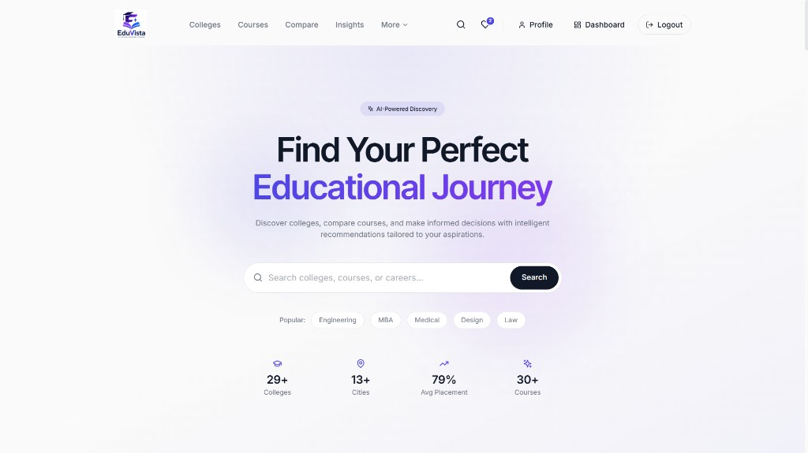

---

### 2. Authentication
Secure login interface with split-screen branding and form validation.

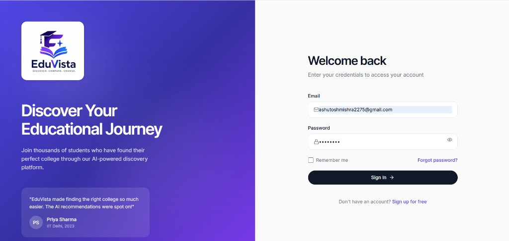

---

### 3. College Listing
Browse colleges with advanced filters, sorting, and grid-based card layout.

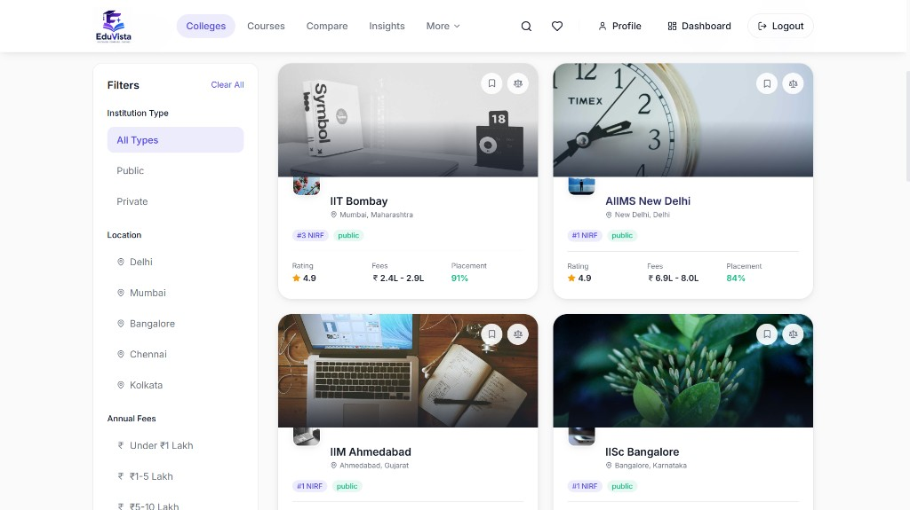

---

### 4. College Details
Comprehensive college profile with rankings, stats, courses, and quick actions.

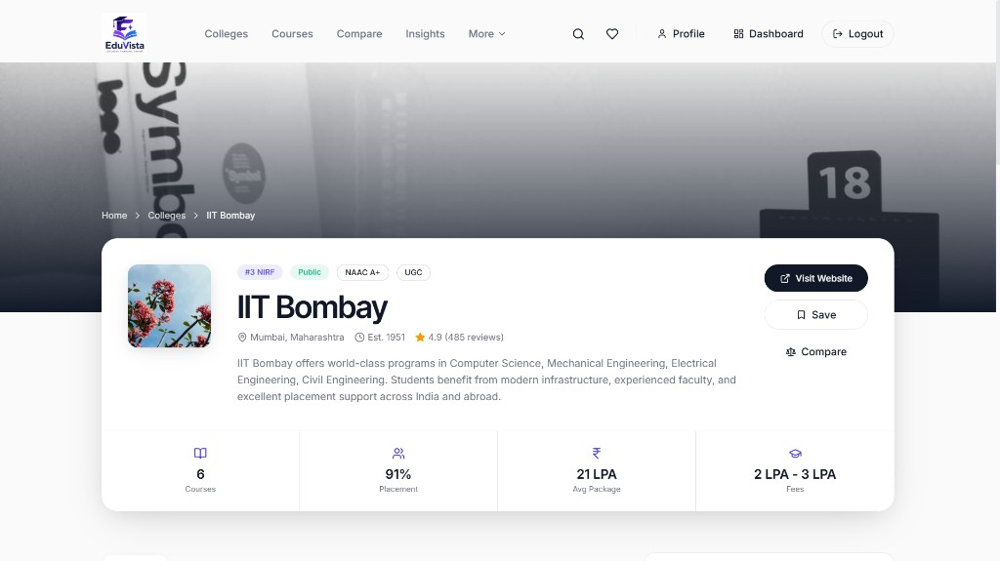

---

### 5. Compare Colleges
Side-by-side comparison of rankings, fees, placements, and key metrics.

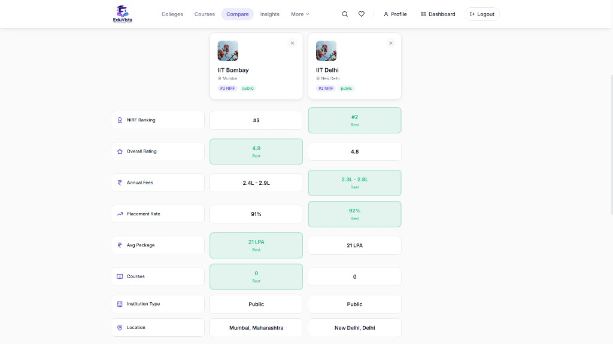

---

### 6. Wishlist
Personal bookmarked colleges with ratings, fees, and one-click compare.

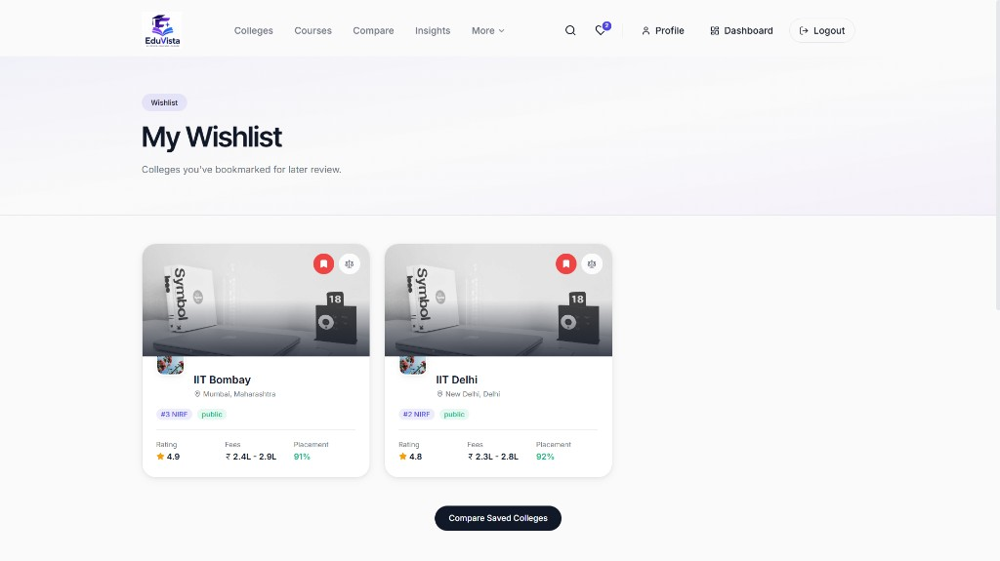

---

### 7. Contact / Enquiry
Contact form with enquiry submission and platform contact information.

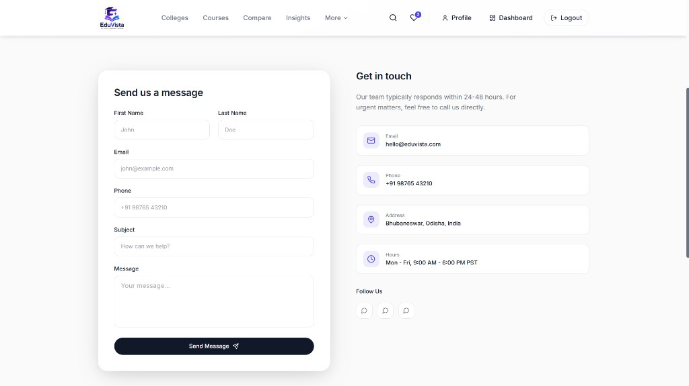

---

### 8. User Dashboard
Personalized student dashboard with AI recommendations and activity overview.

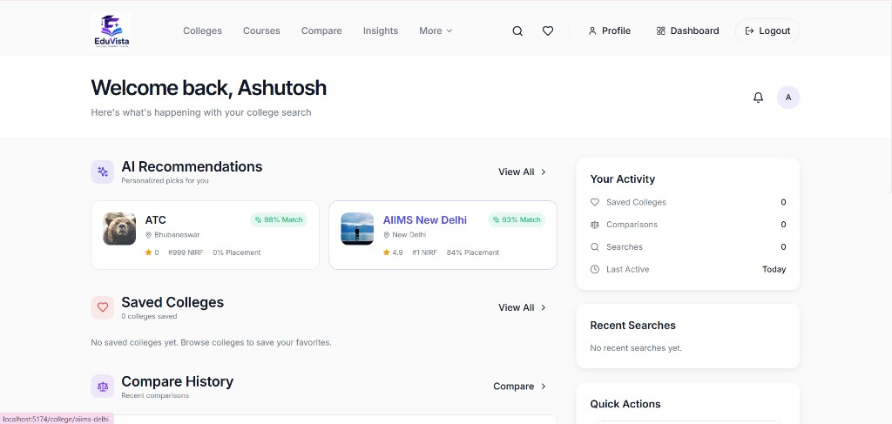

---

### 9. Admin Dashboard
Live admin overview with platform metrics, recent activity, and analytics tabs.

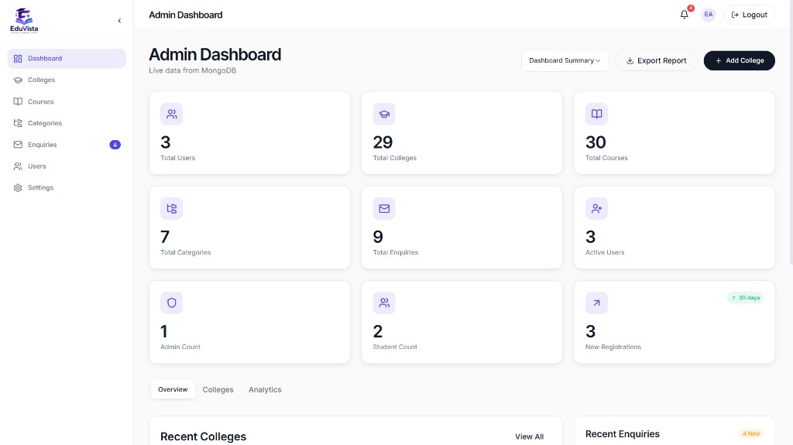

---

### 10. Admin College Management
Full college CRUD interface with search, filters, status controls, and bulk actions.

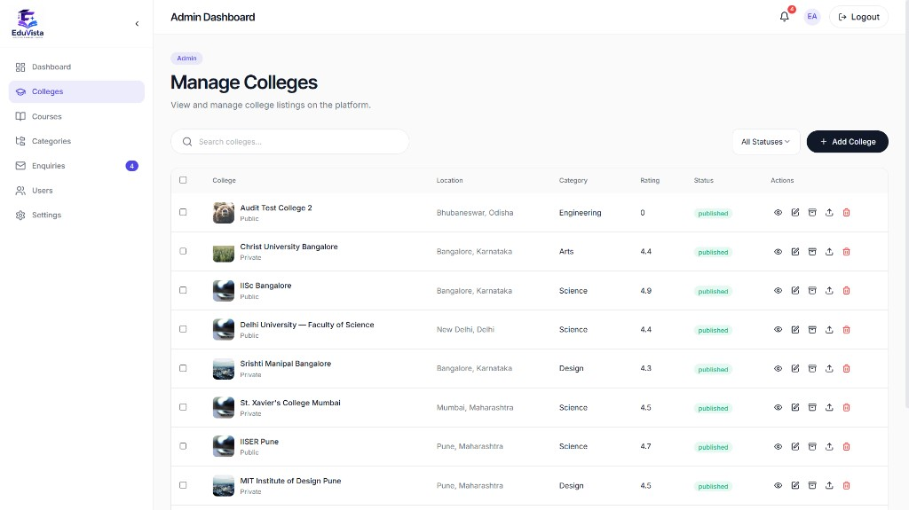

---

### 11. Admin Enquiries
Review and manage student enquiries with search, status filters, and action controls.

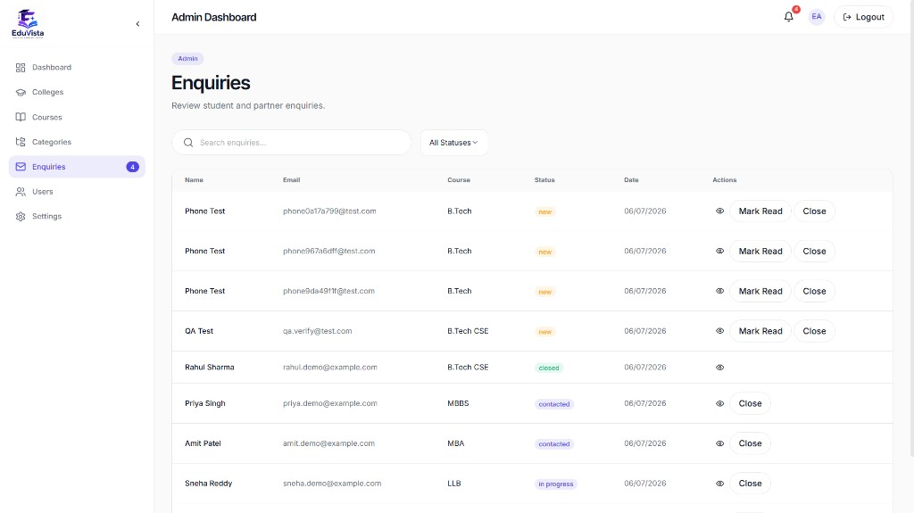

---

### 12. Responsive Design
Mobile-optimized layout with adaptive navigation, search, and content scaling across screen sizes.

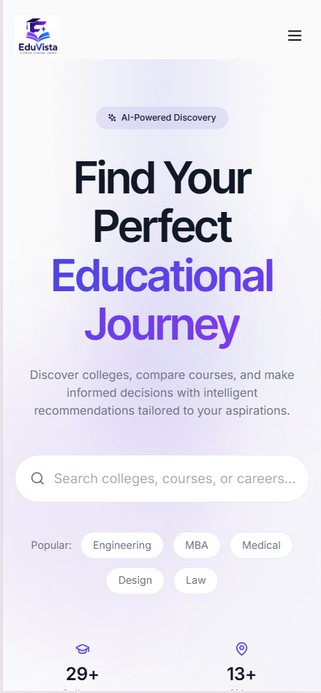

---

## Future Improvements

- Enhanced AI recommendation engine with student preference profiling
- Real-time push notifications for enquiry updates and new listings
- Production email delivery with transactional templates
- Cloudinary-powered profile image upload in user settings
- Automated end-to-end testing and CI/CD pipeline
- Mobile-responsive PWA with offline support
- Advanced admin analytics with interactive charts and date-range filters
- Scholarship and admission deadline tracking module

---

## Author

**Ashutosh Mishra**

- GitHub: [@Ashutosh2275](https://github.com/Ashutosh2275)
- Repository: [EduVista](https://github.com/Ashutosh2275/EduVista)

---

## License

This project is licensed under the **MIT License**.
